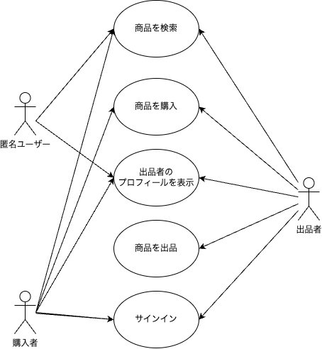

学習教材

アプリケーションの仕様について

【アクター】利用想定者
    匿名ユーザー
    購入者
    出品者

【ユースケース】
    商品を検索
    商品を購入
    商品を出品
    出品者のプロファイルを表示
    サインイン

【注意事項】
    購入者と出品者のアカウントの違いはない

各ユースケースの詳細、関連ページについては以下のようになっています。
| ユースケース | 詳細 | 関連ページ |
| ------------- | ------------- | ------------- |
| 商品を検索 | 商品一覧を表示 | トップページ、検索ページ、商品詳細ページ |
| 商品を購入 | 商品を買い物かーとに入れ、購入 | 買い物カートページ |
| 商品を出品 | 必要な情報を入力し商品を投稿 | 出品ページ |
| 出品者のプロファイルを表示 | 出品者のプロファイル表示、出品者の商品一覧を表示 | ユーザーページ |
| サインイン | ユーザー名とパスワードを入力して、システムにサインイン | サインインぺージ |

ブランチ
* feature/dev-env-setup       環境構築
* feature/api-create          APIクライアント実装
* feature/component-setup     コンポーネント実装の準備
* feature/atomic-design-setup Atomic Design によるコンポーネント設計
* feature/atomic-create       Atoms の実装
* feature/molecules-create    Molecules の実装
* feature/organisms-create    Organisms の実装
* feature/template-create     Template の実装
* feature/pages-setup-create  ページの設計と実装
* feature/component-unit-test コンポーネントのユニットテスト
